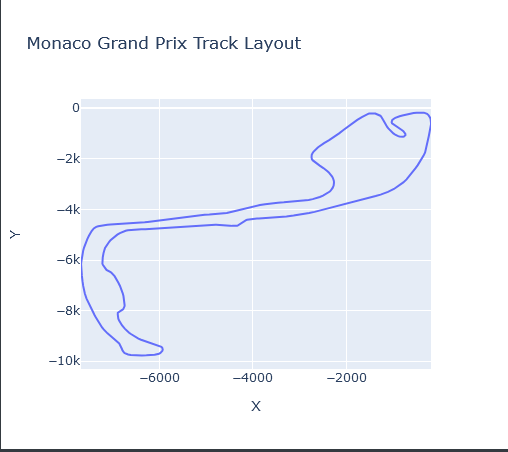
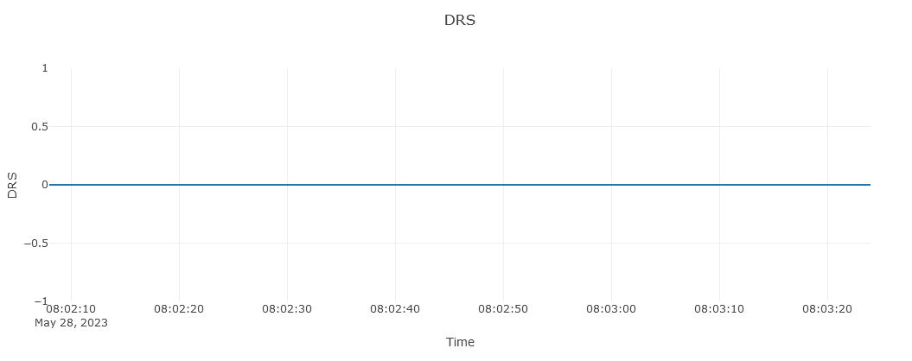

"""
# F1-RaceFlow

F1-RaceFlow is a web application that allows users to visualize Formula 1 race data. The app leverages the `fastf1` library to fetch race session data and telemetry, and `plotly` for creating interactive plots.

## Features

- Select year, Grand Prix, session, and driver
- View interactive track layout and lap times
- Detailed telemetry data for each lap
- Separate charts for Speed, Throttle, Brake, Gear, and DRS

## Screenshots

### Selection Screen


### Track Layout



### Laptime


### Lap Details





## Installation

1. Clone the repository:
   ```bash
   git clone https://github.com/your-username/F1-RaceFlow.git
   cd F1-RaceFlow
   ```

2. Create and activate a virtual environment:
   ```bash
   python -m venv f1tempo-env
   source f1tempo-env/bin/activate  # On Windows, use \`f1tempo-env\\Scripts\\activate\`
   ```

3. Install the dependencies:
   ```bash
   pip install -r requirements.txt
   ```

4. Run the application:
   ```bash
   python app.py
   ```

5. Open your browser and go to `http://127.0.0.1:5000/`.

## Usage

1. Select the desired year, Grand Prix, session, and driver to view interactive race data visualizations.
2. View the track layout and lap times in interactive plots.
3. Click on a lap in the lap time plot to see detailed telemetry data for that lap, displayed in separate charts for Speed, Throttle, Brake, Gear, and DRS.

## Project Structure

```plaintext
F1-RaceFlow/
├── app.py
├── config.py
├── utils.py
├── templates/
│   ├── base.html
│   ├── index.html
│   ├── race.html
├── static/
│   ├── styles.css
├── images/
│   ├── selection_screen.png
│   ├── track_layout.png
│   ├── laptime.png
│   ├── lap_details.png
├── .gitignore
├── requirements.txt
├── README.md
```